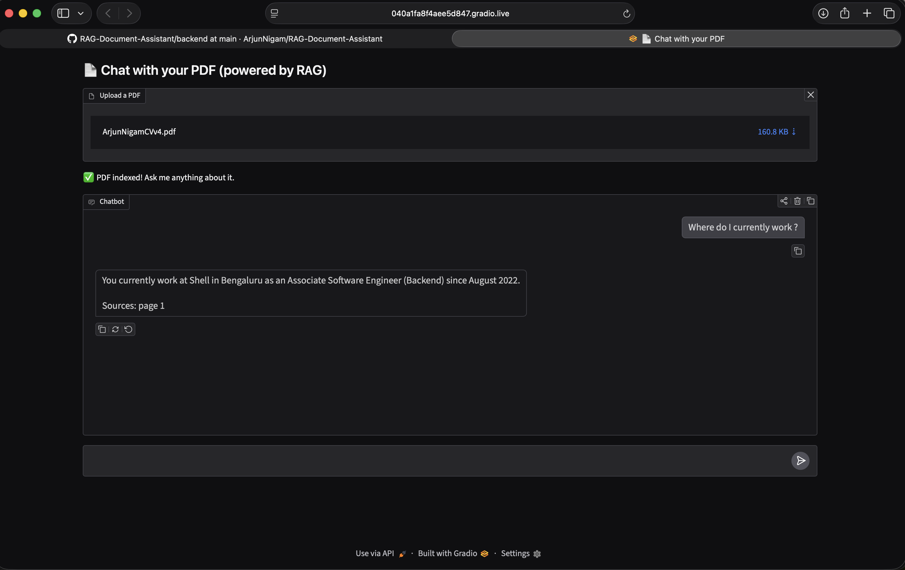
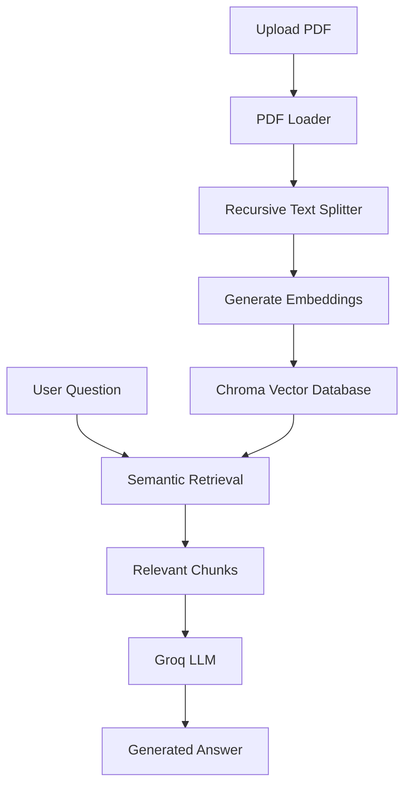

# 📄 RAG Document Assistant

An AI-powered application that enables users to chat with PDF documents using Retrieval-Augmented Generation (RAG).



## 📖 Overview

An AI-powered document question-answering application that enables users to interact with PDF documents using Retrieval-Augmented Generation (RAG). The application combines semantic search, vector embeddings, and Large Language Models (LLMs) to generate context-aware responses.

The application extracts content from uploaded PDFs, splits it into semantic chunks, generates vector embeddings, stores them in a Chroma vector database, retrieves the most relevant context for a user's question, and generates accurate answers using a Large Language Model (LLM).

Built with a modular architecture using LangChain, ChromaDB, Hugging Face Embeddings, Groq, and Gradio.

## ✨ Features

- 📄 Upload and process PDF documents
- 💬 Ask natural language questions about uploaded documents
- 🔍 Semantic search using vector embeddings
- 🧠 End-to-end Retrieval-Augmented Generation (RAG) pipeline
- 🤖 Provider-agnostic LLM architecture (currently using Groq)
- 📚 Hugging Face embedding model for document indexing
- 🗄️ Chroma vector database for efficient retrieval
- 🖥️ Interactive Gradio-based user interface
- ⚙️ Modular and extensible project architecture


## 🛠️ Tech Stack

| Category | Technologies |
|----------|--------------|
| Language | Python |
| UI | Gradio |
| LLM Framework | LangChain |
| LLM Provider | Groq |
| Embedding Model | Hugging Face (all-MiniLM-L6-v2) |
| Vector Database | ChromaDB |
| PDF Processing | PyPDF |
| Environment Management | python-dotenv |


## 🏗️ Architecture




## 🚀 Installation

### 1. Clone the repository

```bash
git clone https://github.com/ArjunNigam/RAG-Document-Assistant.git
cd RAG-Document-Assistant
```

### 2. Create a virtual environment

```bash
python3 -m venv .venv
source .venv/bin/activate
```

### 3. Install dependencies

```bash
pip install -r requirements.txt
```

### 4. Configure environment variables

Create a `.env` file in the project root.

```env
LLM_PROVIDER=groq
GROQ_API_KEY=your_groq_api_key
MODEL_NAME=llama-3.3-70b-versatile
TEMPERATURE=0
```

### 5. Run the application

```bash
python app.py
```

## 🚀 Future Enhancements

- Support for multiple document uploads
- Conversation memory across queries
- Additional LLM providers (OpenAI, Ollama, Gemini)
- Persistent vector database storage
- Streaming responses
- Source highlighting within PDFs
- Dockerized deployment

## 🙏 Acknowledgements

This project was built to explore Retrieval-Augmented Generation (RAG) concepts and demonstrate how modern LLM applications can be designed using modular software architecture and vector-based retrieval.